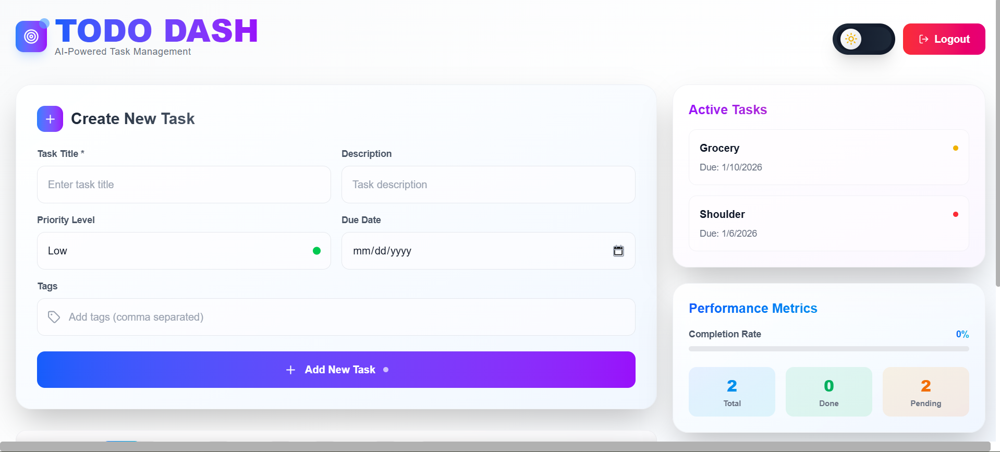
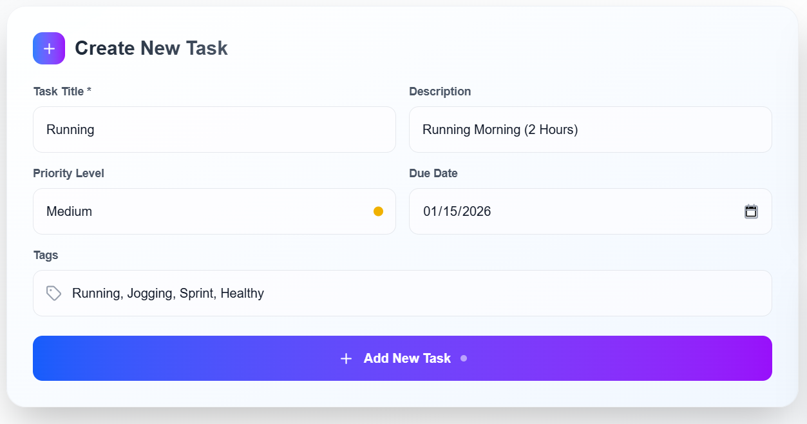
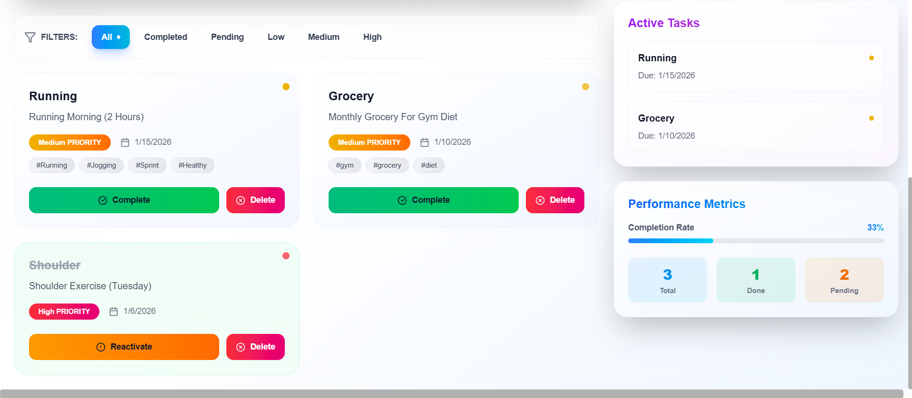
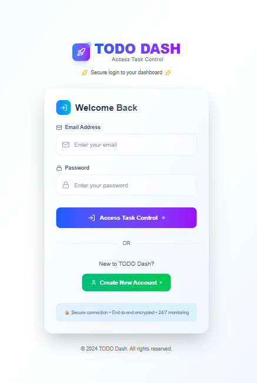
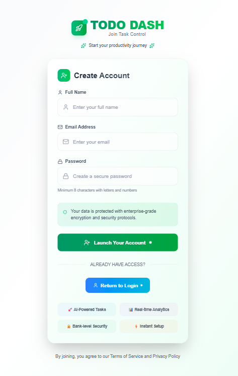

# Advanced AI-Powered MERN Todo App

An advanced **AI-Powered Todo Dashboard** built with the **MERN stack**. Features **dark mode**, **priority-based tasks**, **filters**, **stats panel**, and smooth animations for enhanced UX. Fully deployed on **Vercel** (frontend) and **Railway** (backend).

---

## 🌐 Live Demo

- Frontend: [https://advanced-mern-todo.vercel.app](https://advanced-mern-todo.vercel.app)  
- Backend API: [https://advanced-mern-todo-production.up.railway.app](https://advanced-mern-todo-production.up.railway.app)

---

## 🛠 Tech Stack

- **Frontend:** React, Tailwind CSS, Vite, React Router  
- **Backend:** Node.js, Express.js, MongoDB  
- **Authentication:** JWT (JSON Web Tokens)  
- **Deployment:** Vercel (Frontend), Railway (Backend)  
- **Performance & SEO:** Compression, dark mode preloading

---

## ⚡ Key Features

- ✅ Dark Mode with system preference detection  
- ✅ Add, edit, delete tasks  
- ✅ Task filtering: All, Completed, Pending, Priority (Low, Medium, High)  
- ✅ Dashboard with **stats panel**: Total, Completed, Pending tasks  
- ✅ Responsive design for mobile and desktop  
- ✅ Smooth animations and hover effects  
- ✅ LocalStorage dark mode persistence  
- ✅ Loading and error handling UI  

---

## 📸 Screenshots

  
  

---

## 🚀 Installation & Setup

### **1. Clone the repository**

git clone https://github.com/Abdul-Sami786/advanced-mern-todo.git
cd advanced-mern-todo

### **2. Backend Setup**
cd backend
npm install
create a ".env" file with MONGO_URI and JWT_SECRET
npm start

### **3. Frontend Setup**
cd frontend
npm install
npm run dev

Frontend will run on http://localhost:5173 by default.

## 💡 Future Improvements

User profile & authentication enhancements

Task reminders / notifications

AI-powered task suggestions

Charts & analytics for productivity tracking
